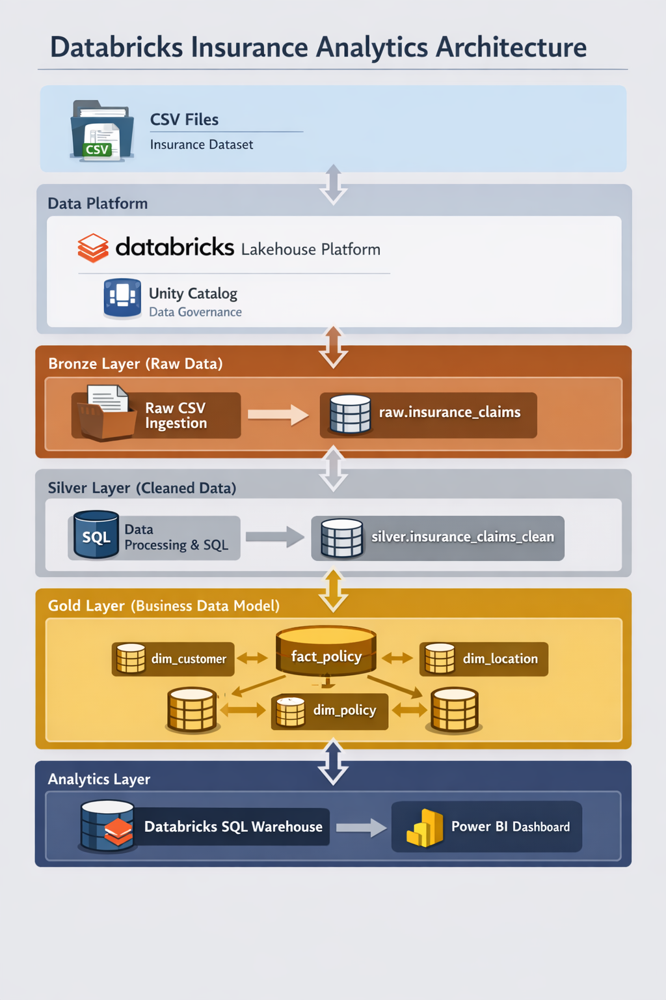
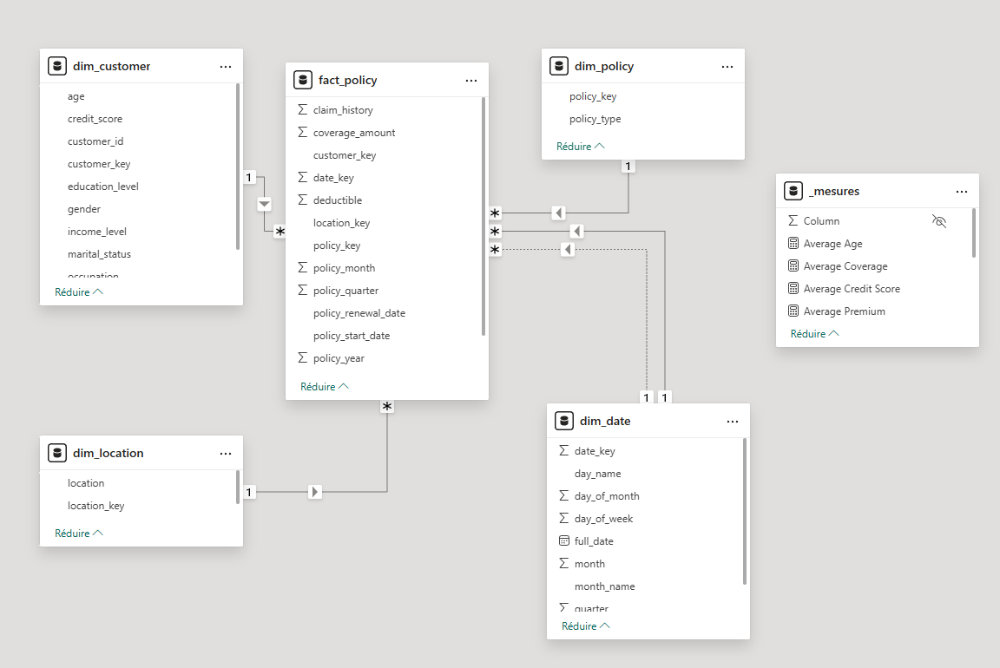
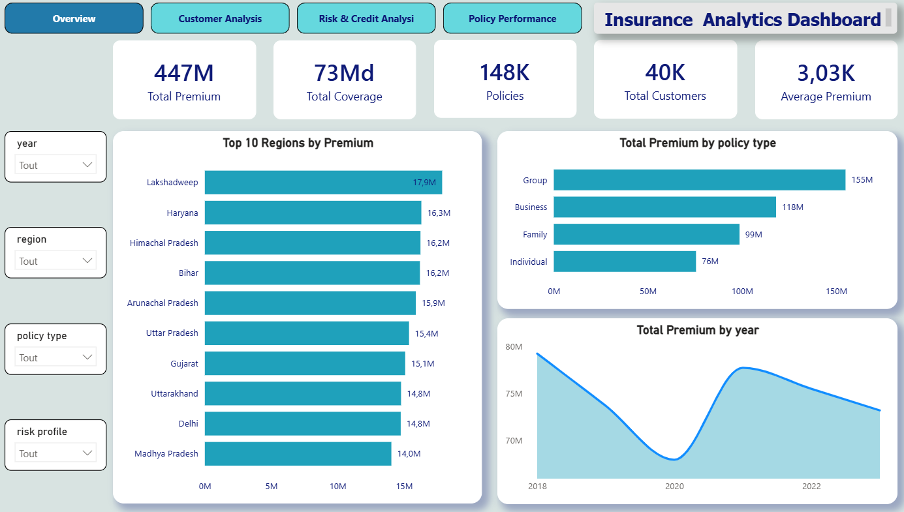
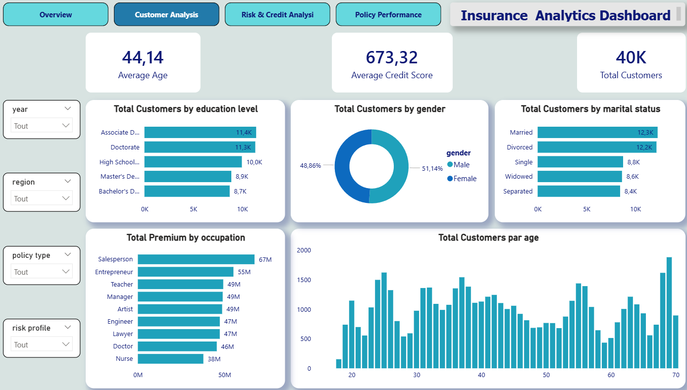
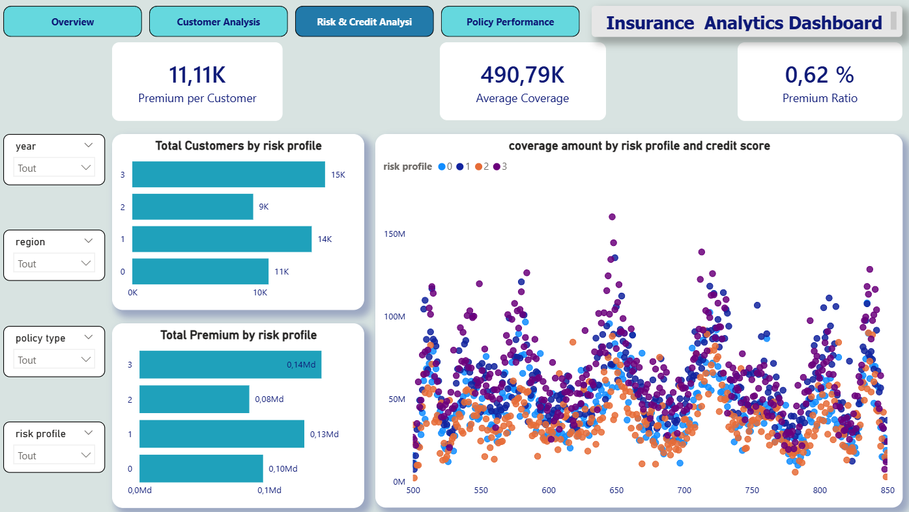
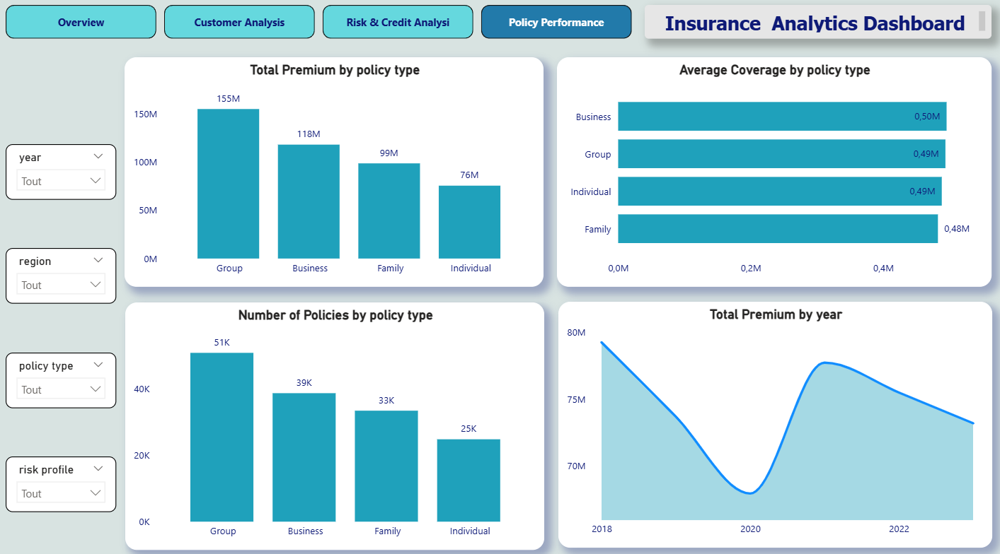

# Insurance Analytics Platform

## Databricks Lakehouse + SQL + Power BI

---

## 1. Contexte du projet

Le secteur de l’assurance repose fortement sur l’analyse des données pour comprendre les profils clients, évaluer les risques et optimiser la performance des produits d’assurance.

Les compagnies d’assurance doivent répondre à plusieurs enjeux :

- analyser la rentabilité des polices d’assurance
- identifier les segments de clients les plus rentables
- détecter les profils à risque
- suivre l’évolution des primes et couvertures dans le temps

Cependant, les données opérationnelles sont souvent stockées sous forme brute (CSV, bases transactionnelles) et ne sont pas directement exploitables pour l’analyse décisionnelle.

Ce projet propose la mise en place d’une plateforme analytique moderne basée sur le Lakehouse Databricks, permettant de transformer des données brutes en **modèle analytique optimisé pour la Business Intelligence**.

## 2. Objectifs du projet

Les objectifs principaux sont :

- concevoir un pipeline de données dans **Databricks**
- appliquer une architecture **Medallion** (**Bronze / Silver / Gold**)
- transformer les données avec **SQL**
- construire un **modèle en étoile** (**Star Schema**)
- créer un **dashboard Power BI interactif**

Le projet permet de répondre à plusieurs questions analytiques :

- Quelle est la répartition des primes par région ?
- Quels types de polices génèrent le plus de revenus ?
- Quels segments clients présentent le plus de risque ?
- Comment évoluent les revenus d’assurance dans le temps ?
- Existe-t-il une relation entre score de crédit et niveau de couverture ?


## 3. Architecture du projet

Le projet repose sur une architecture **Lakehouse Databricks + Power BI**.

Pipeline de données :
```
CSV Dataset
     │
     ▼
Databricks Lakehouse
(Unity Catalog)
     │
     ▼
Bronze Layer (raw data)
     │
     ▼
Silver Layer (cleaned data)
     │
     ▼
Gold Layer (Star Schema)
     │
     ▼
Power BI Dashboard
```

Diagramme d’architecture :



## 4. Technologies utilisées

| Technologie   | Rôle                                 |
| ------------- | ------------------------------------ |
| Databricks    | Plateforme de traitement des données |
| Unity Catalog | Gouvernance des données              |
| SQL           | Transformation et modélisation       |
| Delta Lake    | Stockage des tables                  |
| Power BI      | Visualisation des données            |
| GitHub        | Documentation et versioning          |


## 5. Dataset utilisé

Dataset : Insurance Claims and Policy Data

Il contient des informations sur :

- les clients
- les polices d’assurance
- les primes
- les couvertures
- les profils de risque
- les scores de crédit

Exemples de variables :

| Variable          | Description                |
| ----------------- | -------------------------- |
| customer_id       | identifiant du client      |
| age               | âge du client              |
| gender            | genre                      |
| policy_type       | type de police             |
| coverage_amount   | montant de couverture      |
| premium_amount    | montant de la prime        |
| credit_score      | score de crédit            |
| risk_profile      | profil de risque           |
| policy_start_date | date de début de la police |


## 6. Architecture Medallion

Le pipeline suit l’architecture Medallion.

**Bronze Layer (Raw)**

Stockage des données brutes.

Table :
```
insurance_catalog.raw.insurance_claims
```
Les données sont ingérées directement depuis un fichier CSV.

**Silver Layer (Cleaned Data)**

Nettoyage et transformation des données.

Principales opérations :

- renommage des colonnes
- suppression de colonnes inutiles
- standardisation des types
- gestion des formats de dates

Exemple de traitement SQL pour les dates :
```
COALESCE(
    TRY_TO_DATE(policy_start_date, 'dd-MM-yyyy'),
    TRY_TO_DATE(policy_start_date, 'M/d/yyyy')
) AS policy_start_date
```
Cela permet de corriger les différents formats de dates présents dans le dataset.

**Gold Layer (Business Model)**

Création d’un modèle analytique optimisé pour la BI.

Le modèle suit une structure Star Schema.

Tables :
```
fact_policy
dim_customer
dim_location
dim_policy
dim_date
```

## 7. Création des Dimensions

Les dimensions ont été créées à partir des données nettoyées.

Exemple : dimension client
```
CREATE OR REPLACE TABLE insurance_catalog.gold.dim_customer AS

SELECT
ROW_NUMBER() OVER (ORDER BY customer_id) AS customer_key,
customer_id,
age,
gender,
marital_status,
occupation,
education_level,
income_level,
credit_score,
risk_profile

FROM (
    SELECT DISTINCT *
    FROM insurance_catalog.silver.insurance_claims_clean
);
```

Les surrogate keys sont générées avec ```ROW_NUMBER() OVER()```

Cela permet d'obtenir une clé unique pour chaque dimension.


## 8. Création de la Fact Table

La table de faits contient les mesures analytiques :

- premium
- coverage
- claims

Les dimensions sont reliées via leurs clés.
```
SELECT

    c.customer_key,
    l.location_key,
    p.policy_key,
    d.date_key,

    coverage_amount,
    premium_amount,
    deductible,
    claim_history,
    previous_claims

FROM insurance_catalog.silver.insurance_claims_clean f

LEFT JOIN insurance_catalog.gold.dim_customer c
ON f.customer_id = c.customer_id

LEFT JOIN insurance_catalog.gold.dim_location l
ON f.location = l.location

LEFT JOIN insurance_catalog.gold.dim_policy p
ON f.policy_type = p.policy_type

LEFT JOIN insurance_catalog.gold.dim_date d
ON f.policy_start_date = d.full_date
```

## 9. Modèle de données (Star Schema)

Le modèle final :
```
               dim_customer
                    │
                    │
dim_location ─ fact_policy ─ dim_policy
                    │
                    │
                 dim_date
```

Diagramme du modèle :



## 10. Dashboard Power BI

Un dashboard interactif a été créé pour analyser les données.

Pages du dashboard :

1. Executive Overview



2. Customer Analysis



3. Risk & Credit Analysis



4. Policy Performance



## 11. Résultats

Ce projet démontre la capacité à concevoir une architecture Lakehouse, transformer les données avec SQL, appliquer un modèle Star Schema, construire des dimensions avec surrogate keys et créer un dashboard décisionnel.

## 13. Améliorations possibles

- automatisation du pipeline avec Apache Airflow
- ingestion continue des données
- ajout de modèles Machine Learning pour le scoring de risque
- déploiement du dashboard dans Power BI Service

